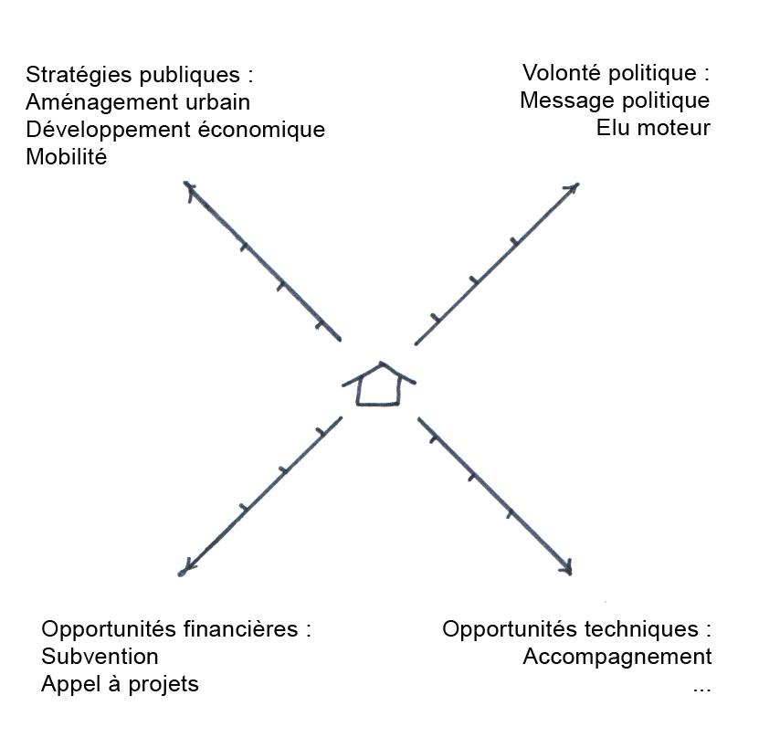
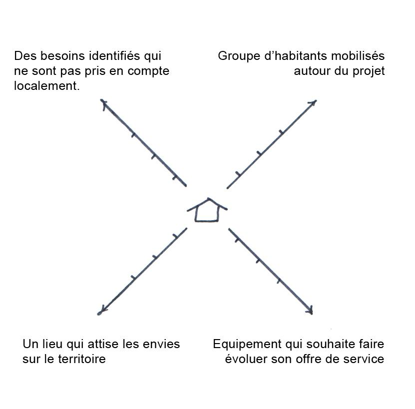
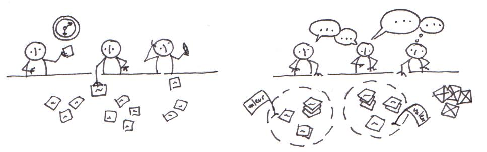
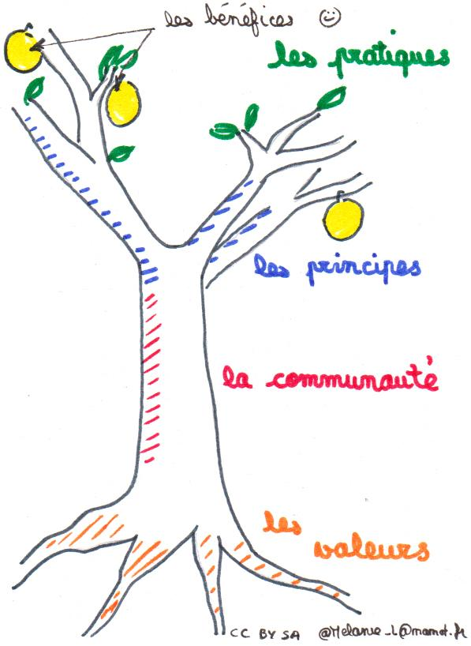
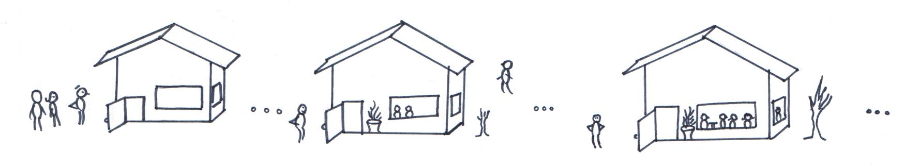
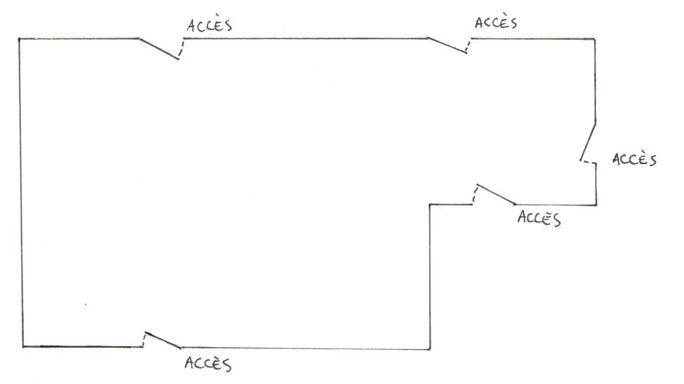
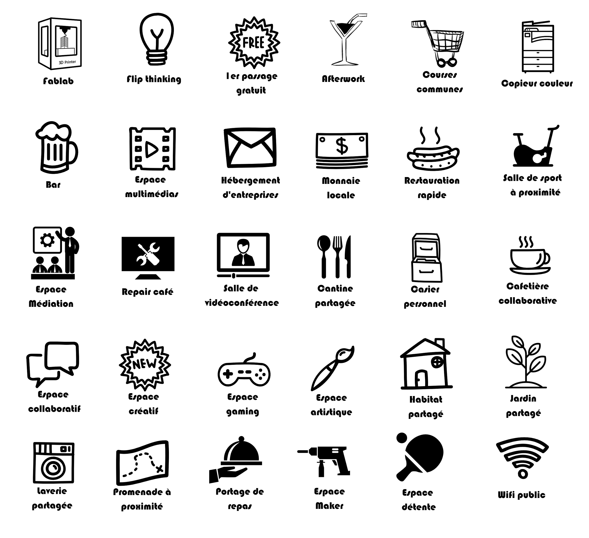

<!--

---
title: Culture tiers-lieux 
description: Cahier d'activités pour créer votre tiers-lieu.
image_url: 
---

-->

# Culture tiers-lieux

## Cahier d'activités pour créer votre tiers-lieu

## PRÉFACE

Ce cahier d'activités s'adresse à toutes les personnes qui souhaitent découvrir ou enrichir leur culture des tiers-lieux. Que vous soyez résidents, novices, curieux ou en pleine élaboration de votre projet, ce livre rassemble les questions à se poser aux différentes étapes du projet.

Ce n'est pas un livre blanc, ce n'est pas un travail de recherche, ni un recueil de bonnes pratiques. Ce cahier n'a pas vocation à apporter des réponses, mais plutôt à poser des questions. **Il ne donne pas le chemin vers le lieu idéal mais il vous permet de dessiner une carte menant à votre tiers-lieu, d'une manière agile et joyeuse.**

Pour utiliser ce cahier vous avez juste besoin d'un crayon et d'une envie de vous lancer dans l'aventure. Il n'y pas de bonnes ou de mauvaises réponses. Pour cette phase de préparation de votre voyage, vous pouvez être seule.e derrière le crayon, mais le voyage sera forcément collectif. En complément des activités que nous proposons dans le cahier, nous vous proposons des pistes d'outils et des méthodes d'animation qui peuvent être mises en oeuvre dans le lieu, sous forme d'exercices pratiques et progressifs, permettant d'avancer étape par étape. En complément des activités proposées, nous avons cherché à vous apporter des ressources, des exemples, des témoignages.

Licence

Ce document a été co-produit par 13 personnes les 23 et 24 mai 2017 dans le cadre d'un booksprint organisé par POP ( [www.pop.eu.com](http://www.pop.eu.com/)) et accueilli par le Vivat à Armentières ( [www.levivat.net](http://www.levivat.net/)). Il répond notamment aux questions que se posent de plus en plus d'acteurs des Hauts-de-France sur la création de tiers-lieux et l'évolution de lieux actuels en tiers-lieux : Espaces Publics Numériques engagés dans la dynamique des &quot;Hauts Lieux&quot; initiée par le Conseil régional, Centres Sociaux dans le cadre du projet Centres Sociaux Connectés, médiathèques, maisons des associations…

Les 13 auteurs contributeurs sont (par ordre alphabétique) : Emilie Bouvier, Laurent Courouble, Henry Foutry, Anthony Jaugeard, Mélanie Lacayrouze, Laetitia Mandon, Claire-Marie Mériaux, Sébastien Plihon, Lilian Ricaud, Carmen Rouchet, Bastien Sibille, Pierre Trendel, Emmanuel Vandamme.

Ce travail est mis à disposition sous licence Creative Commons ce qui vous permet de les partager et de le réutiliser librement selon les conditions suivantes: **Paternité - Partage dans les Mêmes Conditions 3.0 France (CC BY-SA 3.0).**

Ceci est le résumé explicatif &quot;lisible par les humains&quot; du [Code Juridique (la version intégrale de la licence).](http://creativecommons.org/licenses/by-sa/3.0/fr/legalcode)

Vous êtes libre de :

- ** Partager** — reproduire, distribuer et communiquer l'œuvre
- ** Remixer** — adapter l'oeuvre et utiliser cette œuvre à des fins commerciales

Selon les conditions suivantes :

- ** Attribution** — Vous devez attribuer l'oeuvre de la manière indiquée par l'auteur de l'œuvre ou le titulaire des droits (mais pas d'une manière qui suggérerait qu'ils vous approuvent, vous ou votre utilisation de l'œuvre).
- ** Partage dans les Mêmes Conditions** — Si vous modifiez, transformez ou adaptez cette oeuvre, vous n'avez le droit de distribuer votre création que sous une licence identique ou similaire à celle-ci.

Si vous souhaitez copier, modifier, améliorer ce document, le fichier source est disponible au format markdown à l'adresse suivante:

[https://github.com/popuplille/howtotierslieu](https://github.com/popuplille/howtotierslieu)

**INTRODUCTION**

Vous avez entendu parler des tiers-lieux, et vous voulez en savoir plus sur leurs différentes &quot;fonctions&quot; ?

Vous avez visité un tiers-lieu existant, et vous souhaitez savoir si ce lieu peut être préfigurateur de votre projet ?

Vous souhaitez mettre toutes vos compétences au bénéfice de votre structure, et vous vous demandez quel est la plus-value à apporter à l'existant ?

Vous avez la volonté ou la mission de développer votre lieu afin de proposer de nouveaux services et accueillir/toucher d'autres publics ou élargir votre public ?

Vous voulez répondre à un appel à projet pour faire évoluer votre lieu ?

Vous faites partie d'un réseau et souhaitez monter en compétences pour mener à bien votre projet ?

Vous avez identifié des besoins sur le territoire : comment y répondre ?

Vous souhaitez un accompagnement pour construire votre projet ?

Vous souhaitez trouver des partenaires pour avancer dans votre projet ?

Comment faire pour construire votre projet ? Quelles sont les étapes à suivre pour vous poser les bonnes questions ?

ACTIVITE #1 : Dessinez votre tiers-lieu !

_CONSIGNE : Comment imaginez-vous aujourd'hui votre futur tiers-lieu ? Quelles sont ses fonctions ? Comment s'organise l-es espace-s ?_

**L'ETINCELLE**

**1.1 - Un territoire**

Le &quot;Tiers Lieux&quot; est devenu une marque collective qui n'est plus focalisée sur des lieux et des services d'infrastructure, mais sur l'émergence de projets collectifs permettant de produire ensembleet conserver de la valeur sur les territoires.

Le territoire est une production commune : c'est le produit de dynamiques ascendantes (bottom up) et de dynamiques descendantes (top down).

ACTIVITE #2 : Avez-vous pensé à analyser votre territoire ?

Dynamique ascendantes

_CONSIGNE : positionnez votre projet selon les 4 axes._

Dynamique descendantes

CONSIGNE : positionnez votre projet selon les 4 axes

Ce schéma vous permettra d'identifier quelles sont les logiques mises en oeuvre sur votre territoire. Cela vous permettra de connaître le territoire et d'identifier les ressources sur lesquelles vous appuyer.

Pour aller plus loin : quelques pistes de ressources

Besoins du quartier/ groupes d'habitants mobilisés

Renseignez-vous auprès du service politique de la ville de votre commune et / ou intercommmunalité.

Équipements qui souhaitent évoluer

Ressource : Centres sociaux connectés du territoire lillois [https://www.facebook.com/csconnectes/](https://www.facebook.com/csconnectes/)

Stratégies de territoire

Il s'agit ici d'identifier quelles sont les stratégies sur lesquelles vous pouvez vous appuyer.

-&gt; Aménagement urbain : quartiers ANRU/ Requalification de friches urbaines (ex : [Fives Cail babcock](http://www.co-porteurs.fr/) , [Friche Saint-Sauveur](http://www.spl-euralille.fr/nos-projets-urbains/saint-sauveur.html)).

-&gt; Développement économique/ numérique : [schéma de développement d'usage numérique](https://www.nordpasdecalais.fr/jcms/pcw_171313/les-usages-et-services-numeriques) (Renseignez-vous auprès de votre Conseil Régional, de votre intercommunalité).

-&gt; Mobilité : renseignez-vous sur l'existence d'un Bureau des Temps au sein de votre commune ou intercommunalité.

Volonté politique

Renseignez-vous auprès de votre commune, intercommunalité... et lisez le magazine de la collectivité.

Opportunités financières

Renseignez-vous sur l'existence d'appel à projets, d'appel à manifestation d'intérêt (souvent inscrits dans les schémas listés ci-dessus). Ex. [Appel à Projet de la MEL](http://www.lillemetropole.fr/sites/lmcu/mel/outils/kiosque-publications/les-editions-lille-metropole/strategie-resolument-digitale.html).

**1.2 - Une volonté**

ACTIVITE #3 : Pourquoi voulez-vous devenir un tiers-lieu ?

_CONSIGNE 1 : Dans la liste de propositions, choisissez la/les réponse/s où vous vous reconnaissez spontanément ou bien ajouter les vôtres :_

- mutualiser (un espace d'activité, des outils...)
- répondre à un appel à projet ou une demande de financement
- travailler autrement
- dynamiser un lieu existant
- créer un espace de rencontre
- de nos jours, il faut innover
- croiser les disciplines/métiers/profils
- réhabiliter un lieu désaffecté
- s'ouvrir sur le quartier ou sur le territoire local
- ...
- ...
- ...

L'expérience nous montre que la **raison d'être** et le **sens** d'un projet sont déterminants pour le succès d'un projet de tiers-lieu.

_CONSIGNE 1 : Maintenant relisez vos réponses._

Est ce que les raisons qui vous poussent à faire ce projet sont attractives pour vos usagers, votre communauté ?

Pour lancer une dynamique collective et que la communauté s'approprie le lieu, il est important de clarifier ce qui nous rassemble, les valeurs communes, les principes de fonctionnement, les objectifs poursuivis.

D'ailleurs, connaissez vous **votre communauté**? Quelles en sont les valeurs partagées ?

ACTIVITE #4 :  La Scierie des valeurs et l'Arbrifeste

La scierie des valeurs : un outil pour clarifier les valeurs communes d'un collectif

CONSIGNE :

_1/ Chaque participant note entre 3 et 5 valeurs sur des post-it (Un mot par post-it). Lister rapidement pour ne pas trop réfléchir._

_2/ Mise en commun, la scierie ! On enlève la moitié des post-it. Empiler les doublons, faire des rapprochements (Peut-on grouper des synonymes ? …)_

_Le temps est contraint, à faire en 1 à 2 minutes ne pas s'enliser dans des discussions._

_3/ Elagage : En 30 secondes réduire encore de moitié._

_4/ Répétez l'opération... jusqu'à obtenir les valeurs prépondérantes du groupe._

_5/ Pour avoir plusieurs valeurs, faire plusieurs ateliers._

_Il faut arriver à garder seulement 3 à 5 valeurs à la fin du processus._

_Le principe est que c'est la règle du jeu qui endommage les valeurs, pas un participant contre l'autre. Cela facilite la discussion autour de ce sujet qui peut être brûlant._

Recette pour cette méthode : [http://www.multibao.org/#lilianricaud/travail-en-reseau/blob/master/scierie-des-valeurs.md](http://www.multibao.org/#lilianricaud/travail-en-reseau/blob/master/scierie-des-valeurs.md)

**L'abrifeste est un format utilisant la métaphore de l'arbre pour s'aligner collectivement sur des objectifs et des fonctionnements communs. Il permet de trouver une zone de valeurs communes  tout en gardant aussi les valeurs propres à chacun.**

_CONSIGNE : Sur un paperboard dessiner un arbre. Prévoir plein de post-it pour lister les idées._

_- Placer sur les racines les valeurs en précisées oralement au préalable par la SCIERIE DES VALEURS._

_- sur les branches indiquer les principes de fonctionnement (viennent renforcer les valeurs)_

_- les feuilles servent à lister les pratiques_

_- les fruits servent à lister ce que l'on souhaite obtenir._

_Lister individuellement sur des post-it les principes, pratiques et souhaits sur des post it puis mettre en commun et échanger pour s'aligner collectivement._

Recette pour cette méthode : [http://www.multibao.org/#lilianricaud/travail-en-reseau/blob/master/arbrifeste.md](http://www.multibao.org/#lilianricaud/travail-en-reseau/blob/master/arbrifeste.md)

**1.3 - Une communauté**

Intro : (cf dessin parchemin pour illustrer)

_Il n'y a pas de recette miracle ni de liste exhaustive, construisez votre communauté au fur et à mesure, musclez-la, regardez-la évoluer et laissez-la vous surprendre._

ACTIVITE #5 : Construisez votre communauté avec les Picto Cubes

CONSIGNE : Puzzle façon Tangram, à découper, avec un espace pour le Prénom Nom de la personne, et pour sa ou ses compétences.

Nom
Prénom
Compétence

**7 pièces, plus de 1000 figures. A vous de jouer !**

On connait tous le célèbre, parfois galvaudé, mais toutefois souvent vrai : &quot;Seul on va plus vite, ensemble on va plus loin&quot;.

**Pourquoi ?**

La démarche que vous entreprenez est une course de fond, un enchaînement de marathons, avec quelques sprint intermédiaires.

=&gt; A plusieurs, vous pouvez vous compléter, prendre le relais les uns des autres, en terme d'énergie, d'envies, de compétences, ...

**Pourquoi ?**

Avancer en communauté permet, dès le départ de votre démarche, d'intégrer  les besoins des utilisateurs / usagers.

**Pourquoi ?**

Parce qu'à plusieurs, on peut cumuler les compétences, les envies, les savoirs-faire de chacun pour mieux avancer ensemble.

Les compétences qui peuvent être utiles :

- Chef de projet : il coordonne, énergise, enclenche, partage la vision

- Chercheur d'Or : celui qui sait où trouver des ressources financières.

- Designer-Architecte : de solutions, d'espaces,...

- Communicant : il aime partager l'enthousiasme et l'énergie du projet, faire savoir les savoirs-faire,

- Dév : parce qu'à un moment, on a toujours besoin d'outils numérique, d'un site, etc...

- à compléter...

**1.4 - Un lieu existantVotre espace peut être** : une médiathèque, un espace public numérique (cyber-centre, cyber-base, cyber-espace), une maison des associations, un centre social, une maison de l'emploi, un espace inoccupé mis à disposition par une municipalité ou une entreprise, un espace à réhabiliter (café, gare), un local collectif résidentiel...

Vous ne partez pas de rien, votre espace contient déjà des ressources. Ces ressources peuvent être :
- matérielles : pièces, bureaux, chaises, consommables...
- culturelles : valeurs, règles de fonctionnement...
- humaines : compétences, réseaux d'acteurs…

ACTIVITE #6 : Vos ressources existantes

| _CONSIGNE : Notez ici les ressources dont vous disposez :_           |
| --- |

A partir de l'existant, imaginez et ré-inventez votre lieu !

- --Listez ici ce dont vous ne voulez plus / pas.
- --Listez ici ce que vous souhaitez conserver de l'existant (pour l'instant).
- --Listez ici ce que vous souhaitez créer.

Exemple du Mutualab : D'abord une communauté, qui se retrouve pour travailler à L'Ecart (un bar à Lille), puis dans un petit lieu de 100m2 sans wifi et sans eau les 1ers jours (rue de la piquerie à Lille), puis au Mutualab, dans 700m2, puis 800, puis 1000...

Vous ne partez pas de rien, votre collectif possède un intérêt commun. Cet intérêt peut être guidé par :

- un besoin identifié sur votre territoire : créer un lieu de médiation numérique, créer une &quot;Ruche qui dit oui&quot; ou une AMAP...
- une envie : faire différemment, pouvoir fabriquer ses objets localement...
- des valeurs partagées : bienveillance, ouverture, réciprocité…

ACTIVITE #7 : Nos intérêts communs

| _CONSIGNE : Notez ici vos intérêts communs._          |
| --- |

A partir de vos centres d'intérêts, imaginez un lieu qui vous ressemble !

- --Listez ici ce que votre communauté ne veux pas dans votre lieu.
- --Listez ici ce qui fait l'unité de votre communauté au sein de votre lieu.
- --Listez ici les lieux qui font rêver votre collectif (et ce que ces lieux ont en commun).
- --

ALLUMER LE FEU

**2.1 Ouvrir**

_&quot;D'abord tu le fais, après tu le fais bien, enfin tu le fais mieux…&quot;  _

Ouvrez votre lieu au plus vite, même s'il est imparfait, pas fini, encore un peu moche et mal fichu. Vous apprendrez plus et plus vite une fois confronté au réel que si vous y réfléchissez seul dans un bureau à rédiger une stratégie à 10 ans…

Vous pourrez ainsi &quot;prototyper&quot; et tester vos idées, vos apprentissages seront plus rapides et ancrés au réel, basés sur les usages de votre communauté.

**2.2. Aménager**

ACTIVITE #8 : Placez les curseurs

Dans l'ouvrage &quot;_Make Space :  How to set the stage for creative collaboration_&quot;, il est dit : &quot;Space is the body language of an organization&quot; [&quot;L'espace est le langage corporel de l'organisation&quot;]. Derrière cette phrase, se cache une question clé de l'aménagement de l'espace d'un tiers-lieu : il doit être le reflet de votre communauté.

Comment travaille-t-elle ? Ses membres se réunissent-ils souvent ? En petit, en grand groupe ? Le lieu est ouvert à tous en permanence ou seulement à certains moments ?...

Répondre à ces questions, c'est commencer à aménager l'espace pour répondre aux besoins d'une communauté et non l'inverse.

Pour vous guider dans cette activité, essayer de placer les attentes de votre communauté sur ces différents curseurs :

Travail solo            …………………………………………   Travail collectif

Confort individuel  …………………………………………    Convivialité

Manuel                  …………………………………………    Numérique

Silencieux              …………………………………………   Sonore

Confidentiel          …………………………………………     Partagé

Fixe        …………………………………………    Modulable

Espacé                  …………………………………………   Collé-serré

Déco Design         …………………………………………    En mode récup

Vous voyez mieux les besoins de votre communauté ? Maintenant, tentez de mettre cela en scène dans cet espace.

ACTIVITE #9 : Posez les cloisons

Vous allez faire l'exercice plusieurs fois.

La première fois vous avez le droit de placer un seul mur !

La deuxième fois, 2 murs.

La troisième fois, 3 murs, etc…

A chaque fois, indiquez le nom de l'espace, sa capacité d'accueil et quelques mots-clés pour en décrire l'ambiance ! Vous pouvez aussi imaginer d'ajouter un lieu de sieste, un lieu de convivialité (un restaurant, un bar), un espace pour des machines ou des activités poussiéreuses, bruyantes,...

Et vice-versa :

Vous pouvez aussi faire l'exercice en sens inverse : commencez avec 3 murs, puis 2, puis 1…

Où sont vos prises ? Avec des prises au sol, cela sera difficile de déplacer les bureaux ponctuellement ou de réaménager l'espace quand la communauté aura grandit, tandis que si les prises viennent du plafond, cela sera plus facile …Alors où voulez vous mettre les cloisons ? Mais au fait, avez-vous VRAIMENT besoin de mettre des cloisons ? En dur ? Ou légères et déplaçables ? Pourriez vous construire une cabane de réunion en palette pour éviter de lourds travaux ?

**2.3. Coopérer**

Coopérer c'est un objectif et des moyens.

Un **objectif,** car cela permet de :

- --développer nos activités par la synergie avec d'autres. Cette synergie peut se faire entre activités du même secteur ou activités radicalement différentes.
- --nous sentir moins seul-e
- --nous qualifier par l'échange de pratiques
- --augmenter l'impact de nos actions par le regroupement des forces et compétences.

Des **moyens** , car &quot;coopérer&quot; ne tombe pas sous le sens !

Nous ne sommes ni naturellement, ni par notre éducation incités à coopérer.

Pourtant des outils existent :

- --des outils d'organisation des collectifs : Community Organizer/méthode Alinsky, méthodes non-violentes d'organisation, d'expression et de recueil des envies/besoins/apports
- --des outils de gestion des coopérations / coopératives (Ex : Trello, Loomio, …)
- --…

_Nota bene : c'est pas l'outil qui fait l'usage, questionner bien vos objectifs avant de choisir l'outil)_

**2.4. Communiquer**

**Choisir un nom pour son lieu**

Le nom d'un lieu porte avec lui un imaginaire, il peut traduire l'intention de la communauté pour ce lieu, il renvoie une image particulière au public / aux publics.

Le nom choisi pourra avoir des effets sur la visibilité et l'attractivité du lieu. Le temps du choix n'est pas anodin et il pourra soulever des problématiques liées à la gouvernance du projet, à l'accessibilité du lieu, au public qu'il souhaite sensibiliser,...

Quelques animations pour révéler l'imaginaire partagé autour du lieu et faire émerger des propositions de nom :

1 / Le nuage de mots-clés : avec des petits papiers ou en ligne, affichez l'ensemble des idées et associations d'idées des participants avec pour consigne de raconter le lieu tel qu'on le rêve.

2 / L'idéation en lotus : mettre au centre le nom actuel du lieu ou un point de départ qui semble plus adapté (la fonction principale du lieu,...). Par association d'idées, les participants ajoutent 8 propositions autour de l'étiquette centrale. On peut ensuite extraire une ou plusieurs propositions et recommencer un lotus pour chacune d'entre elles.

3 / Une séance de brainstorming… avec quelques règles simples : pas de jugement, recherchez la quantité, rebondir sur les idées des autres, encourager les idées folles, puis les trier.

4/ Une séance de bièrestorming: Quelques bières..., c'est tout simple, et ça peut aider aussi...

**2.5 - Gouverner**

Y a t-il une gouvernance qui permette à tou.te.s et chacun.e de s'approprier le lieu sans pour autant réduire l'initiative individuelle ?

Quelle est la part donnée aux usagers dans les choix concernant le tiers-lieu ?

- **** les usagers ne sont pas consulté.e.s
- **** les usagers sont consulté.e.s
- **** les usagers participent à certaines prises de décision
- **** les usagers participent à la plupart des prises de décision
- **** les usagers ont le dernier mot sur toutes les prises décision
- ****....

Pour aller plus loin:

La gouvernance d'un commun: [https://fr.wikibooks.org/wiki/Construire\_des\_communs/Gouvernance](https://fr.wikibooks.org/wiki/Construire_des_communs/Gouvernance)

Les clés de la gouvernance partagée, la sociocratie, la gestion par consentement, l'élection sans candidat et autres méthodes de l'Université du Nous:

[http://universite-du-nous.org/a-propos-udn/ses-outils/](http://universite-du-nous.org/a-propos-udn/ses-outils/)

La stigmergie: un nouveau modèle de gouvernance collaborative: [http://www.lilianricaud.com/travail-en-reseau/la-stigmergie-un-nouvelle-modele-de-gouvernance-collaborative/](http://www.lilianricaud.com/travail-en-reseau/la-stigmergie-un-nouvelle-modele-de-gouvernance-collaborative/)

**ALIMENTER LA FLAMME**

Une fois que votre lieu est lancé, que vous avez pu confronter au réel tout ce que vous aviez imaginé au cours de la période de conception, vous pouvez re-parcourir chacune des étapes précédentes, et voir comment ça marche, les usages que vous n'aviez pas imaginés et qui se sont auto-installés, ce qui n'a pas marché, ce qui manque, les nouvelles envies qui vous viennent à l'usage, les nouveaux besoins qui émergent, etc…

Ici nous vous inviter à parcourir les étapes clefs d'un lieu en activité.

**3.1 - L'accueil**

L'accueil est le premier contact de vos usagers avec votre tiers-lieu. Ce n'est donc pas anodin. Pour autant il n'y a pas une seule manière de gérer et de faire vivre l'accueil de votre lieu. Voilà quelques questions à vous poser.

ACTIVITE #10 :

1. **1.**** Dans votre tiers-lieu, on est accueilli par :**

A/ **Personne**. Le lieu est ouvert et chacun y accède librement. La signalétique se suffit à elle-même.

B/ **Les usagers**. Quand quelqu'un rentre dans votre espace, il y a toujours quelqu'un qui pourra se rendre disponible pour lui donner les renseignements nécessaires.

C/ **Une personne dédiée**. L'accueil, c'est le rôle d'une personne unique, identifiée et &quot;formée&quot; à donner toutes les informations nécessaires au visiteur.

 D/ **Vous avez une autre solution ?**  Décrivez là en quelques lignes.

……………………………………………………………………………………………

……………………………………………………………………………………………

……………………………………………………………………………………………

**2. Si je viens pour la première fois vous rendre visite, qu'est ce que l'on me raconte en premier ?**

A/ **Les horaires, les tarifs, le règlement intérieur...** Avant tout, le visiteur doit connaître les règles de bases de fonctionnement du lieu pour y participer.

B/ **L'esprit du lieu, sa gouvernance et son histoire**. Comprendre la philosophie du lieu et les gens qui le portent, c'est l'essentiel. Le reste viendra après.

C/ **Autre chose ?** Décrivez le en quelques lignes

……………………………………………………………………………………………

……………………………………………………………………………………………

…………………………………………………………………………………………...

**3. Je suis un utilisateur régulier, si j'ai un souci ou une demande particulière, je m'adresse :**

A/ **Aux autres usagers.** C'est eux qui savent le mieux et l'entraide est de rigueur.

B/ **Toute l'info est sur le site / wiki.** Pour que tout le monde est la bonne info et ne pas répéter toujours la même chose, c'est le plus efficace.

C/ **Une personne dédié.** Pour ne laisser personne dans le doute ou &quot;en panne&quot;, c'est le rôle d'une personne que de venir en aide aux usagers.

D/ **Une autre idée ?** Décrivez le en quelques lignes

……………………………………………………………………………………………

……………………………………………………………………………………………

…………………………………………………………………………………………...

Se poser la question de l'accueil, n'est pas une question simple : elle est souvent le reflet de la dynamique insufflée dans la communauté. Qu'elle soit &quot;auto-gérée&quot;, ou centrée sur une seule personne, vous aurez toujours à vous poser la question de l'appropriation du lieu et de ces valeurs par les nouveaux arrivants.

Quelle que soit la solution choisie, la documentation de votre espace, de ses règles de fonctionnement, de toutes les petites astuces qui permettent d'y évoluer en autonomie et dans le respect des autres est un autre élément essentiel.

Quelques exemples :

De nombreux espaces ont choisi de créer un rôle dédié à ces fonctions : le concierge. C'est le personnage centrale des questions d'accueil et d'animation du tiers-lieu.

Par exemple :
 [http://movilab.org/index.php?title=La\_conciergerie](http://movilab.org/index.php?title=La_conciergerie)
 [http://movilab.org/index.php?title=La\_Conciergerie\_du\_Mixeur](http://movilab.org/index.php?title=La_Conciergerie_du_Mixeur)

Un autre exemple : la fonction de &quot;Bob&quot;, à Mutualab, c'est aussi une variante du rôle de concierge.

[http://wiki.mutualab.org/doku.php?id=bob](http://wiki.mutualab.org/doku.php?id=bob)

A la Coroutine, autre tiers-lieu lillois, c'est la &quot;Fiche à tout faire&quot; qui documente le processus d'accueil et permet à tous membres de s'en emparer :

[http://wiki.lacoroutine.org/contribution:accueil](http://wiki.lacoroutine.org/contribution:accueil)

**3.2 - Les activités**

ACTIVITE #11 : Et dedans, qu'est-ce qu'on y fera ?

_CONSIGNE : Entourez les pictogrammes pour décrire les activités que vous imaginez dans votre lieu._

###

###

**3.3 - La vie du lieu**

ACTIVITE #12 : Le parcours utilisateur

_CONSIGNE : Complétez la Customer Journey Map de votre lieu, vous devriez y retrouver toutes ces variables (et toutes celles auxquelles vous penserez). L'idée est que cette Map permette à tout nouvel utilisateur de comprendre comment fonctionne le lieu :_

- **** Ouverture / fermeture
Horaires fixes, variables
Tous les jours de la semaine ?
Jours fériés ?
=&gt; Partage d'expérience avec avantages et inconvénients

- **** Qui ouvre, qui ferme ?
Personnes de référence et de confiance qui maitrisent la structure… et auxquelles on confie les clefs.
=&gt; Identifier des piliers ou mode partagé

- **** Moyens d'accès
Clés, carte d'accès, digicode, serrure à empreinte
Alarme

- **** Entretien des locaux
Service externalisé
Partagé entre les usagers
L'animateur du lieu

- **** Achat des consommables, qui, comment ?
Fonds communs
Une personne responsable
Tous les utilisateurs du lieu
Définir modalités de remboursement (pièces comptables etc…)

- **** Achat et maintenance du matériel partagé (Imprimante, papier, cartouches)
Quotas ?
Liste de fournisseurs autorisés ?
Liste des consommables pour éviter d'acheter la mauvaise cartouche pour l'imprimante

- **** Nourriture
Achats et repas en commun
=&gt; Exemple Coroutine et services type openfood france
Modalités de stockage
Modalités de destockage (qui, et selon quelles modalités, peut jeter le vieux fromage qui est depuis 3 mois dans le frigo?)

- **** L'accueil des usagers
Bureau d'accueil avec Monsieur ou Madame Accueil ?
Pôle accueil ?
Tout le monde accueille ?
Quelles sont les plages horaires ?

- **** Modèle de gestion

Plutôt autogéré ?
Plutôt un salarié ?
Plutôt une conciergerie des réciprocités ?

- --Modèle de gouvernance

- Quel modèle de responsabilité pour gérer votre lieu au quotidien : casquettes tournantes ? bureau (CA) ? volontaires ?

- Qui gère les problèmes du quotidien ?

- Qui gère les problèmes plus structurants ?

- Qui décide / tranche en cas de non majorité émergente des échanges de la communauté ?

(Exemple d'outil numérique qui peut vous aider dans la décision collective : Loomio)

- **** Les temps forts qui font vivre votre lieu

Repas partagé ?
Conférences et ateliers ?
Pecha kucha ?
Programmation artistique ?
Les midis sportifs ?
Des apéros communs ?

Des grandes fêtes ?

**3.4 - Modèle économique**

ACTIVITE #13 : Dépenses et recettes

**Quelles sont les dépenses mensuelles du lieu ?** Il peut s'agir de dépenses directement assumées par le le lieu, ou par des partenaires (ex. mise à disposition de locaux ou de personnel municipal)

- les locaux : loyer, entretien, assurance... [750 - 7500€]

- les charges de fonctionnement : eau, électricité, accès internet...  [150 - 1500€]

- l'équipement : amortissement sur 3 ans (= diviser le montant d'investissement par 36 !) des meubles, de l'équipement informatique... [100 - 1000€]

- les consommables : café, papier, post-its... [50 - 500€]

- les personnes qui travaillent pour le lieu [500 - 5000€]

- la communication  [50 - 5000€]

**Quelles sont les recettes mensuelles du lieu ?** Il peut s'agir de recettes directes ou de valorisation de mise à disposition.

- la participation des usagers, comprenant des prestations fixes (ex. abonnement coworking) et variables (ex. refacturation des impressions) : en moyenne [10 - 100€] usagers par mois qui paient en moyenne [50 - 500€] chacun = [500 - 50000€]

- les adhésions (pour les associations)

- la vente de services

- la mise à disposition d'espaces, la location de salles

- l'accompagnement de projet, le conseil, la formation de porteurs de projets…

- d'autres services ?

- les financements publics : subventions Europe, Etat, Région, collectivités...

- les financements privés : appels à projets de fondations, dons…

- les financements par la communauté : tipeee, Liberapay, …

Quelles peuvent être les recettes exceptionnelles du lieu ?

Notamment à l'occasion du lancement du lieu vous pouvez vous faire aider à financer vos dépenses d'amorçage.

- une campagne de crowdfunding,

- des subventions d'investissement/de démarrage par les territoires,

- des financements privés par des investisseurs ou des fondations : prise de capitaux, emprunts, subventions

Louer ou acheter son lieu ?

Le collectif Catalyst (Hauts de France) a commencé à travailler sur le sujet de l'achat en mode collectif. Nous souhaitons travailler avec un organisme afin d'étudier la manière d'étendre le principe d'accession sociale à la propriété au secteur tertiaire. La société d'exploitation, les usagers et une collectivité territoriale deviendraient sur le long terme, propriétaires collectivement d'un lieu socialement innovant.

Vous pouvez retrouver les éléments de réflexion ici : http://movilab.org/index.php?title=Propri%C3%A9t%C3%A9\_d%27un\_tiers\_lieux

**Un modèle économique, c'est quoi ?**

Le modèle économique, c'est la logique générale de fonctionnement économique du lieu. Tous les lieux ont une dimension économique, même ceux qui par exemple n'utiliseraient pas de monnaie (le troc, c'est de l'économie), même ceux qui sont financés à 100% par les acteurs publics et dont les services sont &quot;gratuits&quot; pour leurs utilisateurs. Ce sont juste des modèles économiques différents. On peut distinguer l'économie marchande &quot;classique&quot; (vente de biens ou de services), l'économie de redistribution (subventions permettant de financer des services gratuits ou moins chers que l'offre du marché) et l'économie de réciprocité (don / contre-don basé ou non sur le temps).

Que vous en ayez conscience ou non, vous avez un modèle économique, choisi ou contraint. Le modèle économique n'est pas induit par le statut juridique. Par exemple, une association peut avoir une activité marchande (mais non lucrative), une entreprise sociale peut bénéficier de financement public et opter pour la non-lucrativité. Ce modèle économique n'est sans doute pas le point de départ de l'activité, mais c'est une traduction économique de cette activité. Votre modèle économique d'aujourd'hui est peut-être différent de celui qui correspond à l'activité à laquelle vous aspirez.

La question du modèle économique consiste à définir quels sont les services rendus, et qui finance ces services : est-ce l'usager/client en direct, est-ce un financeur public ou privé, est-ce une solution mixte ? Dans tous les cas, il est intéressant de définir les produits, leur valeur (qui dépasse le prix de vente), et de penser ces produits pour les usagers, bref mettre un peu de marketing dans l'affaire…

Comment ça se passe dans les tiers-lieux ?

Le Mutualab est un lieu de 1000 m2 en centre ville de Lille, dont le budget mensuel est de 15 000 € dont 10 000 € de loyer, 2 000 € de charges de fonctionnement et 3 000 € de salaires. Ces dépenses sont couvertes à 80% (à vérifier) par les membres (tickets, abonnements ) et pour le reste par les locations de salles de réunion ou de l'espace conférence. Le mutualab, par choix, ne reçoit pas de subvention, ni ne preste de services directement. Il anime également une communauté d'utilisateurs qui apportent du temps volontaire à l'organisation globale (rencontres régulières appelées &quot;mélées&quot;, le 7 de chaque mois)

**Et pour vous ?**

- **** Qui sont nos &quot;client.e.s&quot; ?
- **** Quels sont nos produits ?
- **** Le lieu a-t-il une activité marchande ou non marchande ?
- **** Quels sont les coûts fixes de fonctionnement ?
- **** Quelles charges exceptionnelles doivent être anticipées (chaudière, travaux,... ) ?
- **** L'activité est-elle bénéficiaire, déficitaire, à l'équilibre ?
- **** L'activité est-elle lucrative (redistribution d'excédent à des actionnaires), non-lucrative,d'une lucrativité réduite ?
- **** y'a-t-il une logique d'accessibilité de votre service à des publics précaires ? (prise en charge par subventions privés ou publiques)
- **** Appel à contribution : et vous, quel est votre modèle économique, quel est votre budget ?

**3.5 - Ancrage réseau**

ACTIVITE #15 : Quelles sont les ressources utilisées par la communauté qui peuvent être partagées en dehors de la communauté ?

- **** Des méthodes d'animation?
- **** Du temps ?
- **** Des espaces ou des services proposés par le lieu
- **** Un fournisseur d'accès internet ?
- **** Un outil de réservation, de facturation d'espace ou de matériel ?
- **** Un récit d'expérience ?

**Existe-t-il un réseau de tiers-lieux sur mon territoire ?**

- **** Les acteurs du numérique sont-ils déjà en réseau ?
- **** Les acteurs de l'Économie Sociale et Solidaire ?
- **** Les acteurs de l'Innovation Sociale ?
- **** Avez-vous pensé à lancer un message sur les réseaux sociaux ?

**Quelques**** exemples**

Votre tiers-lieux a déjà une histoire, celle du mouvement des tiers-lieux, qui se développe depuis 1995, avec l'ouverture du premier hackerspace C Base à Berlin.

Les Tiers-Lieux sont devenus une marque collective dont l'esprit implique de ne plus être focalisé sur des lieux et des services d'infrastructure, mais vers l'émergence de projets collectifs permettant de co-créer et conserver de la valeur sur les territoires.

Se pose alors la question de l'impact du tiers lieux et de la mutualisation des ressources à l'échelle d'un réseau.

Vous n'êtes pas seul.e ! Il existe parfois des réseaux actifs à l'échelle locale : exemple le [réseau aquitain](https://coop.tierslieux.net/) est très structuré, le réseau lillois : [http://hauts.tiers-lieux.org/](http://hauts.tiers-lieux.org/) fonctionne en pair à pair, les bretons en ont aussi un [http://www.bretagne-creative.net/article185.html](http://www.bretagne-creative.net/article185.html)

Tous ces réseaux s'inspirent des pratiques numériques qui impliquent transparence et duplicabilité des modèles.

Pas de réseau chez vous ? Peut-être est ce le moment d'en lancer un…? Avant de vous lancer, envoyez un message sur le groupe [https://www.facebook.com/groups/tilios/](https://www.facebook.com/groups/tilios/)

Quelques outils simples pour lancer un réseau et faciliter une dynamique contributive :

- **** Un site avec des ressources et une cartographie participative
- **** Un espace de discussion autour des tiers lieux permet les échanges au sein du collectif, qui peut prendre la forme d'une liste de discussion, des meet-up réguliers.
- **** Un outil open source qui évolue très vite met à disposition des ressources numériques : [https://www.communecter.org/](https://www.communecter.org/) **Comment favoriser la mise en réseau ?**

La problématique est identique à celle d'un lieu : il faut définir les intérêts communs. Pourquoi se mettre en réseau ? L'intérêt des lieux n'est pas forcément celui de la collectivité locale, ni celui des usagers, bref, une petite session de consensus avec plusieurs parties prenantes peut aider à ne pas partir dans tous les sens.

C'est ici que se pose la belle question des communs. Comment s'appuyer sur des ressources partagées par le réseau ? Comment les produire ? les gérer collectivement ? Ici, vous avez quelques pistes de solutions : [http://hauts.tiers-lieux.org/appel-a-communs/](http://hauts.tiers-lieux.org/appel-a-communs/)

L'acteur public peut aider les lieux à se mettre en réseau, c'est d'ailleurs une tendance que l'on observe un peu partout, portée par les intercommunalités et/ou les Régions (voir chapitre territoire).

**3.6 - Ancrage territorial**

Trop souvent un lieu est uniquement pensé par rapport à lui même sans tenir compte de l'extérieur. Or le territoire global ou l'espace local dans lequel il est inséré ont des influences sur ce qui s'y passe.

Pensez au-delà des murs : quel est votre lien avec le territoire, comment êtes vous inséré.e.s dans le paysage ou le quartier ? Quels sont vos lien avec le voisinage, ...

ACTIVITE #16 : Qui sont les acteurs de notre territoire ?

Décrivez le profil (en mode _persona_) des différentes entités qui vous entoure : la Région, la Communauté Urbaine, la Communauté de Communes, les voisins.

###

###

**[CONCLUSION]**

Vous ne réussirez peut-être pas à mettre en oeuvre toute la démarche décrite précédemment du premier coup ou dans l'ordre décrit.

Ce qui est important de c'est de démarrer MAINTENANT, d'expérimenter et de recommencer (=d'itérer) !

Pensez bien à  documenter (en CC) vos réflexions et vos cheminements sur un wiki ou une timeline, afin d'être une communauté apprenante, qui progresse et avance.

ACTIVITE #17 : Re-dessinez votre tiers-lieu

**Ressources :**

La time line de la coroutine =&gt; [https://cdn.knightlab.com/libs/timeline/latest/embed/?source=1EFavJEK47HQN6cJaSaR7tp1bI90DrSFEvijWFW6UQeY&amp;font=Bevan-PotanoSans&amp;maptype=toner](https://cdn.knightlab.com/libs/timeline/latest/embed/?source=1EFavJEK47HQN6cJaSaR7tp1bI90DrSFEvijWFW6UQeY&amp;font=Bevan-PotanoSans&amp;maptype=toner)

**SOURCES ET RESSOURCES**

**5.1 - En ligne**

**La coopérative des tiers-lieux**

La Coopérative Tiers Lieux est née d'un collectif constitué de créateurs et animateurs de tiers-lieux qui se sont réunis pour partager leurs expériences avec d'autres porteurs de projets et pour faire connaître ces nouvelles organisations du travail.

La coopérative a produit le [poster](http://coop.tierslieux.net/wp-content/uploads/2014/10/Infographie_Comment-cr%C3%A9er-un-tiers-lieu-version-finale_18072014.pdf) qui a servi de base à la rédaction cet ouvrage.

[https://coop.tierslieux.net](https://coop.tierslieux.net/)

Movilab

Chaque jour, [des milliers d'actions remarquables sont réalisées partout dans le monde](http://movilab.org/index.php?title=Comment_fabriquer_des_biens_communs_en_open_source_%3F#Des_exemples) allant dans le sens d'une évolution durable de nos modes de vie.

Elles demandent de l'énergie, de l'argent, des compétences et des savoirs qui sont le plus souvent locaux et [propres à chaque territoire](http://movilab.org/index.php?title=Qu'est_ce_qu'un_territoire_d'interpr%C3%A9tation_%3F). Initiatives intéressantes, elles sont souvent difficilement transmissibles hors de leur contexte d'origine car non documentées de façon universelle.

MoviLab est une [méthodologie de documentation](http://movilab.org/index.php?title=La_m%C3%A9thodologie_Movilab) de ces actions remarquables en [code source](http://movilab.org/index.php?title=Code_source) qui s'appuie principalement sur l'écosystème et le processus des [Tiers Lieux](http://movilab.org/index.php?title=Le_manifeste_des_Tiers_Lieux) pour être mise en œuvre localement.

Voir :

- **** [La définition des tiers-lieux](http://movilab.org/index.php?title=D%C3%A9finition_des_Tiers_Lieux) selon Movilab
- **** [Le manifeste des tiers-lieux](http://movilab.org/index.php?title=Le_manifeste_des_Tiers_Lieux)

**5.2 - En librairie**

Tiers-lieux ... Et plus si affinités, Antoine Burret (Fyp Editions)

Aménager son territoire avec les tiers-lieux de travail Broché, Pascal Rassat (Territorial Éditions)

FabLabs, etc : Les nouveaux lieux de fabrication numérique, Camille Bosqué et Laurent Ricard (Editions Eyrolles)

**5.3 - En vrai**

Le mieux pour comprendre un tiers-lieu et se faire sa culture c'est d'aller voir en vrai, rencontrer des personnes, échanger. Quelques adresses pour aller vivre directement l'expérience d'un tiers-lieu:

Mutualab (Lille, 59) innovation sociale, numérique

[http://www.mutualab.org/](http://www.mutualab.org/)

La Co-Routine (Lille, 59)  innovation sociale, numérique

[http://lacoroutine.org/](http://lacoroutine.org/)

Les Imaginations Fertiles (Toulouse, 31): innovation sociale, artisanat, design

[http://imaginationsfertiles.fr/](http://imaginationsfertiles.fr/)

La Mutinerie (Paris, 75) économie collaborative, numérique

[http://coworking.mutinerie.org/](http://coworking.mutinerie.org/)

Open Factory (St-Etienne, 42),  innovation sociale, numérique, design, fabrication numérique

[http://www.openfactory42.org/](http://www.openfactory42.org/)

L'arrêt minute (Libourne, 33)

[http://www.arretminute.fr/](http://www.arretminute.fr/)

GLO(u)SSAIRE

MEL : Métropole Européenne de Lille

ANRU : Agence Nationale de Rénovation Urbaine

AMAP : Association pour le Maintien de l'Agriculture Paysanne

SDUS : Schéma Directeur des Usages et Services numériques

ACTIVITE #18 : Crée toi-même ton acronyme

